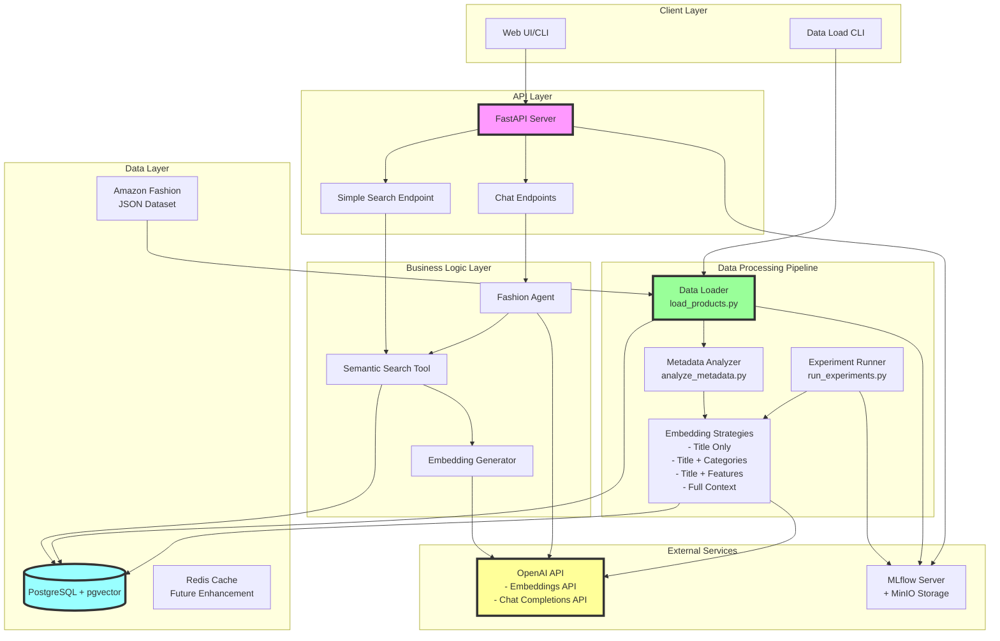
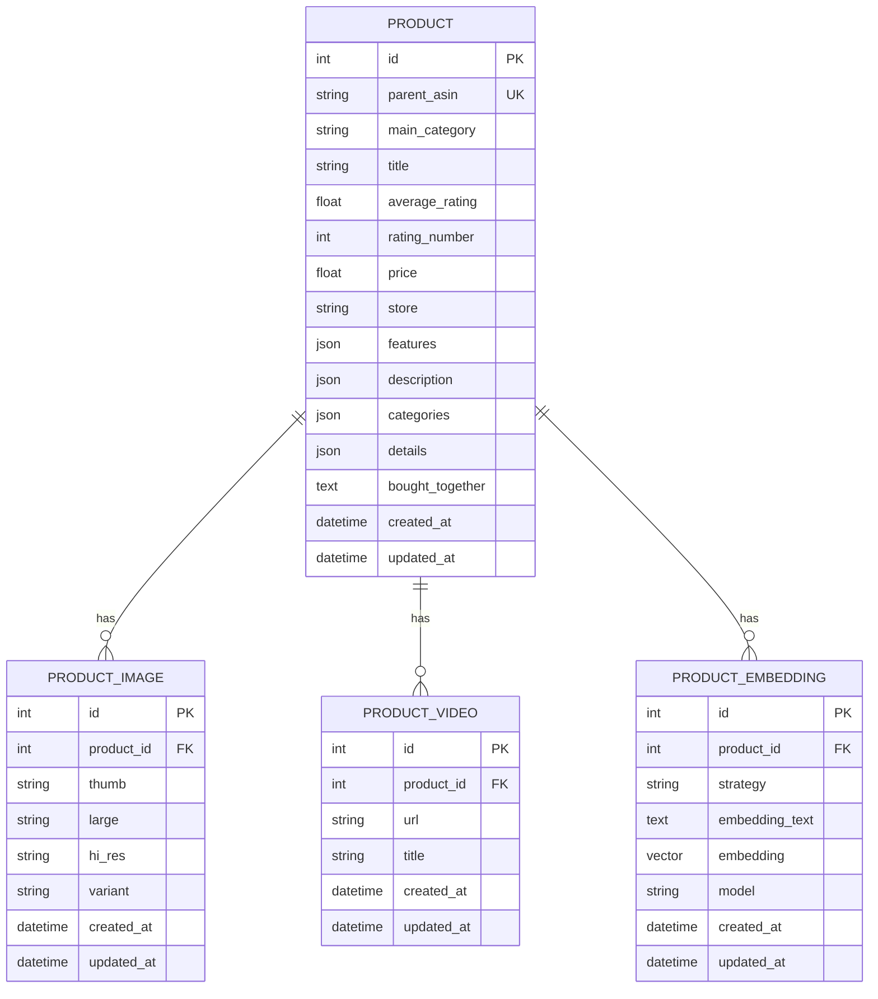
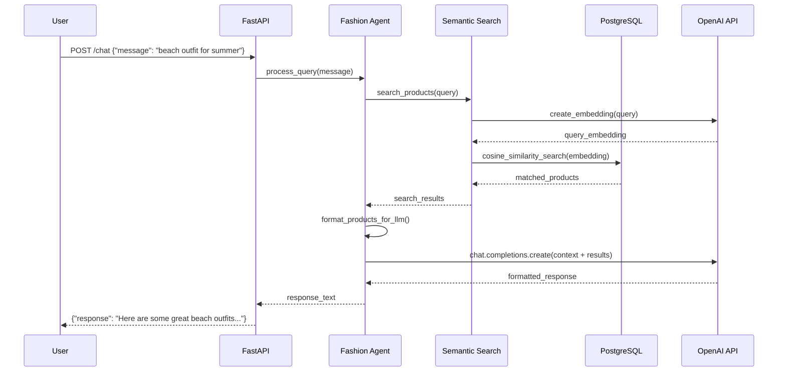
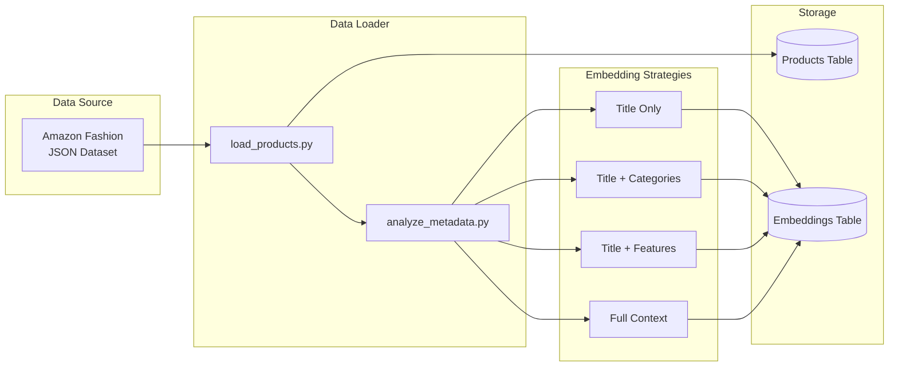
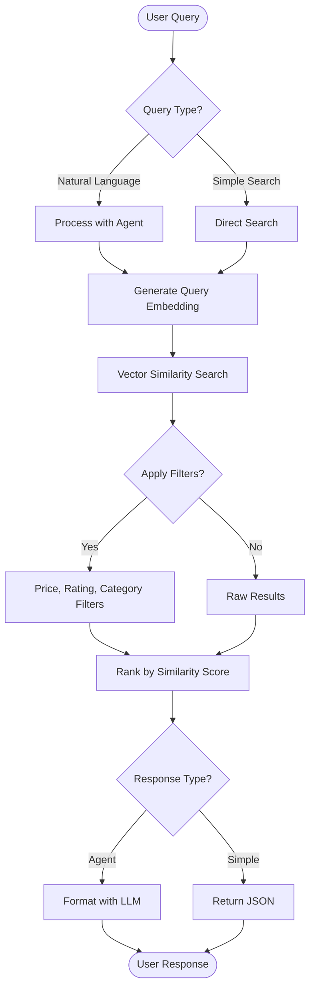
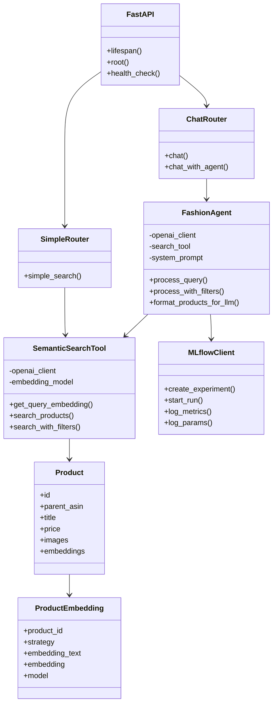
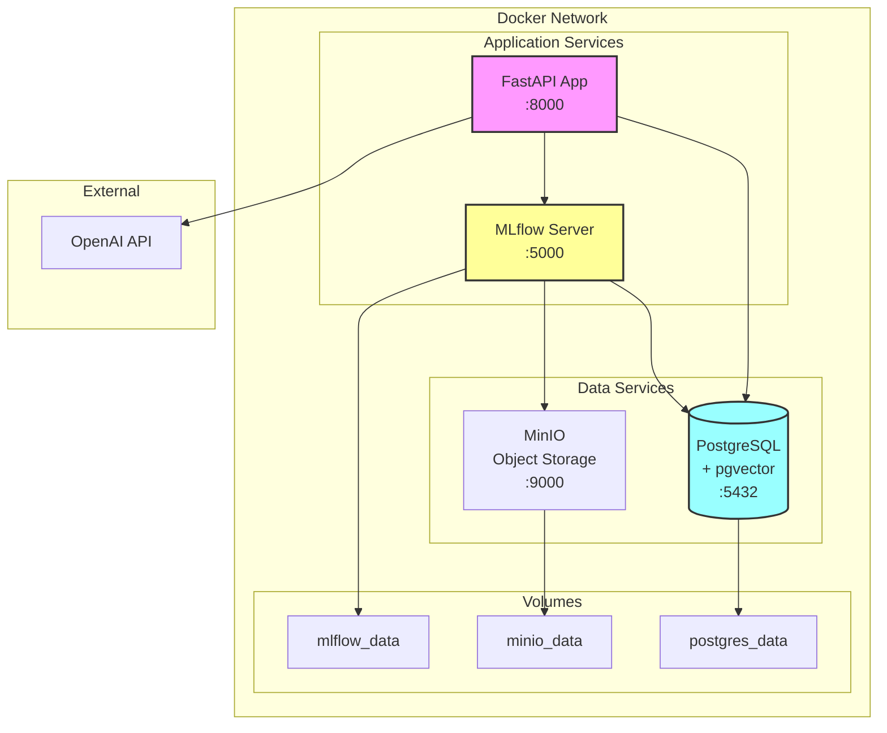

# Fashion Semantic Search System Design

## Overview

This document provides a comprehensive design overview of the Fashion Semantic Search microservice, which enables natural language queries for fashion products using semantic search capabilities powered by OpenAI embeddings and PostgreSQL with pgvector.

## Table of Contents
1. [System Architecture](#system-architecture)
2. [Database Schema](#database-schema)
3. [API Flow](#api-flow)
4. [Data Processing Pipeline](#data-processing-pipeline)
5. [Search Flow](#search-flow)
6. [Component Interactions](#component-interactions)
7. [Deployment Architecture](#deployment-architecture)

## System Architecture

### High-Level Architecture

## Database Schema

### Entity Relationship Diagram

## API Flow

### Request Processing Sequence

## Data Processing Pipeline

### Product Loading and Embedding Generation

## Search Flow

### Semantic Search Process

## Component Interactions

### Class and Module Dependencies

## Deployment Architecture

### Docker Compose Services

## Key Design Decisions

### 1. Vector Database Choice
- **PostgreSQL + pgvector**: Chosen for simplicity and unified data storage
- Supports cosine similarity search with good performance for 300-item dataset
- Easy integration with existing relational data

### 2. Embedding Strategy
- **text-embedding-3-small (1536 dimensions)**: Balance between quality and cost
- Multiple embedding strategies tested via MLflow experiments
- Normalized vectors for stable cosine similarity

### 3. Two-Stage Query Processing
- **Stage 1**: Semantic search for relevant products
- **Stage 2**: LLM formatting for natural language response
- Provides both explainability and conversational interface

### 4. Modular Architecture
- Separate concerns: API, Agent, Search Tool, Database
- Easy to test and modify individual components
- Support for both simple search and agent-based queries

## Performance Considerations

1. **Caching Strategy** (Future Enhancement)
   - Redis for query embedding cache
   - Product result caching for popular queries

2. **Index Optimization**
   - IVFFlat or HNSW indexes for larger datasets
   - Currently using exact search for 300 items

3. **Batch Processing**
   - Bulk embedding generation during data loading
   - Async processing for non-blocking operations

## Security Considerations

1. **API Key Management**
   - Environment variables for sensitive data
   - Separate `.env` files for different environments

2. **Input Validation**
   - Pydantic models for request/response validation
   - SQL injection prevention via SQLAlchemy ORM

3. **Rate Limiting** (Future Enhancement)
   - Prevent API abuse
   - Cost control for OpenAI API calls

## Future Enhancements

1. **Advanced Search Features**
   - Multi-modal search (image + text)
   - Outfit composition using graph relationships
   - Personalization based on user history

2. **Scalability Improvements**
   - Distributed vector search with dedicated vector DB
   - Horizontal scaling with load balancer
   - Event-driven architecture for real-time updates

3. **Analytics and Monitoring**
   - Search quality metrics dashboard
   - A/B testing framework for embedding strategies
   - Real-time performance monitoring

## Conclusion

This semantic search system provides a foundation for natural language fashion product discovery. The modular architecture allows for easy experimentation and enhancement while maintaining production stability. The use of industry-standard tools (FastAPI, PostgreSQL, OpenAI) ensures maintainability and community support.
