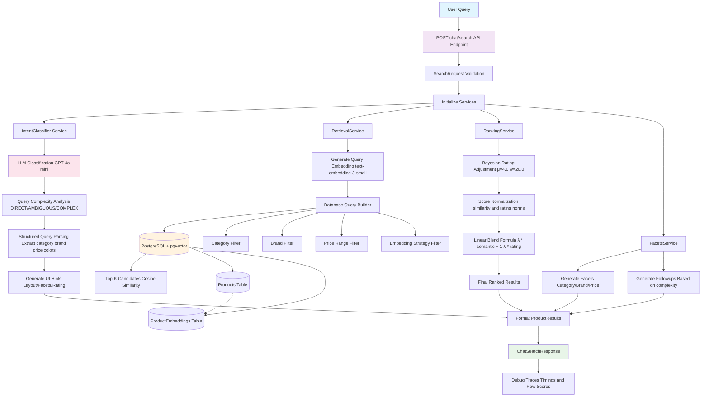

# Fashion Search Architecture Analysis

## Complete Search Flow Mermaid Diagram



## Architecture Components Breakdown

### 1. API Layer (`app/api/search.py`)
- **Endpoint**: `POST /chat/search`
- **Input**: `SearchRequest` (query, topK, lambda_blend, debug)
- **Output**: `ChatSearchResponse` with structured product results
- **Features**: Debug tracing, error handling, performance monitoring

### 2. Intent Classification (`app/services/intent_classifier.py`)
- **Model**: GPT-4o-mini with JSON response format
- **Classification**: DIRECT/AMBIGUOUS/COMPLEX query complexity
- **Parsing**: Extracts category, brand, colors, price ranges, filters
- **Fallback**: Rule-based classification if LLM fails

### 3. Retrieval Service (`app/services/retrieval.py`)
- **Embedding Model**: text-embedding-3-small
- **Search Strategy**: Cosine similarity using pgvector
- **Default Strategy**: "key_value_with_images" embeddings
- **Filters**: Category, brand, price range with ILIKE matching
- **Top-K**: Retrieves up to 200 candidates by default

### 4. Ranking Service (`app/services/ranking.py`)
- **Bayesian Rating**: Shrinkage toward prior (μ=4.0, w=20.0)
- **Normalization**: Per-query min-max scaling for similarity scores
- **Linear Blend**: `final_score = λ * s' + (1-λ) * r'`
- **Default Lambda**: 0.85 (favors semantic similarity)
- **Tie Breaking**: By rating count, then price

### 5. Database Architecture
- **Products Table**: Core product metadata
- **ProductEmbeddings Table**: Vector embeddings with strategy labels
- **Vector Extension**: pgvector for cosine distance operations
- **Indexes**: Optimized for similarity search performance

### 6. Agent Tools Layer (`app/agents/tools/search.py`)
- **SemanticSearchTool**: Lower-level database interface
- **Direct Queries**: Raw cosine similarity search
- **Filter Support**: Price, rating, category filters
- **Multiple Strategies**: Different embedding approaches

## Key Technical Decisions

### Embedding Strategy
- **Choice**: text-embedding-3-small
- **Strategy**: "key_value_with_images" as default
- **Rationale**: Balance of performance and quality for fashion search

### Ranking Formula
- **Linear Blend**: Combines semantic similarity with quality signals
- **Bayesian Adjustment**: Handles rating reliability and new products
- **Lambda Parameter**: Tunable semantic vs. quality trade-off

### Search Pipeline
- **Multi-Stage**: Intent → Retrieve → Re-rank → Enhance
- **Scalable**: Top-K retrieval with post-filtering
- **Flexible**: Query complexity drives UI adaptation

### Data Flow
```
User Query → LLM Classification → Vector Search → Bayesian Re-ranking → Faceted Response
